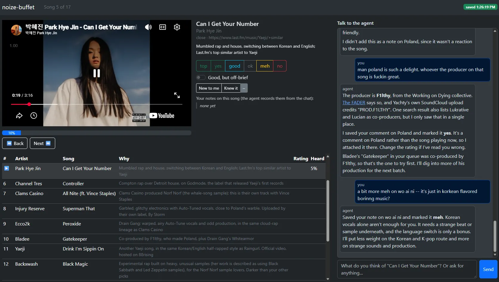
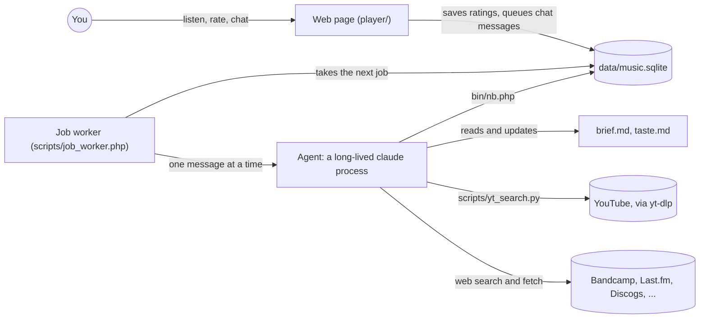

# noize-buffet

An endless, ever-changing stream of music suggestions, built around your taste and run entirely on your own machine.

You chat with an AI agent in a local web page. It asks what you're after, then keeps adding batches of YouTube songs to a queue. You listen in the embedded player. It records how far you got, your rating, your notes and whether a song was new to you, and each new batch learns from that.

## Requirements

- [Claude Code](https://claude.com/claude-code), logged in with your own account (it runs the agent)
- PHP 8.1+ with `pdo_sqlite`
- Python 3 and [yt-dlp](https://github.com/yt-dlp/yt-dlp)
- A TypeSafe API key in `.env` (`start.py` creates `.env` from `.env.example` for you). Comment mining, planned for a later stage, uses it. `start.py` stops if the key is missing; to run without one, use `python3 start.py --no-typesafe`

## Start

    python3 start.py

It checks the requirements, creates `.env` if needed, starts the web server and the agent worker together, and prints the address: http://localhost:8000, or a random free port between 8001 and 8999 if 8000 is taken. `NB_PORT=8080 python3 start.py` uses exactly that port. Ctrl+C stops both.

To start over from scratch, run `python3 start.py --reset`. It stops this folder's old server, worker and agent processes, then **permanently deletes** your queue, ratings, notes, chat, `brief.md` and `taste.md` (after you type `RESET` to confirm), and starts fresh. `.env` and `config.json` are kept.

## How it works

`start.py` runs two processes: a small PHP web server for the page, and a job worker. Everything you do in the page goes into a local SQLite database. Each chat message you send becomes a job, and the worker passes jobs one at a time to the agent. The agent is a headless Claude Code session that stays running between messages, so replies after the first skip Claude Code's start-up time. It follows the rulebook in [`CLAUDE.md`](CLAUDE.md).

A typical run goes like this:

1. On first run the agent interviews you, one question at a time: what you're hoping to find, a few songs you love and why, and what you don't want. It looks up the songs and artists you named and checks anything unclear with you. Then it writes `brief.md` (your goal, in your words) and `taste.md` (its notes on your taste).
2. Before choosing a batch, the agent researches each seed song on the web: its label and roster, its producers and collaborators, similar-artist pages, and the scene around it. A single person's recommendation needs a second, independent signal before it counts. The agent finds each song on YouTube with `yt_search.py` and adds about 12 to the queue: mostly songs close to what you like, some from its leads, and one wildcard that tests an edge of your taste. Each song records why it's there and the page that led to it.
3. The page plays the queue. For each song it records how far you got, your rating (top, yes, good, ok, meh, no), whether it was new to you, and whether it's good but not what you're looking for ("off-brief").
4. You tell the agent what you think of the song that's playing ("love the drums", "the vocals are generic"). It saves your comment as a note on that song, fills in the rating and toggles your comment implies (you can change them), and updates `taste.md`. You can also paste a song you found, ask for more songs, or ask it to stop suggesting an artist.
5. The next batch starts from your ratings, notes and chat since the last one, plus the leads the agent has already collected.

While the agent works, the chat shows what it's doing ("Searching YouTube (12 songs)…", "Reading bandcamp.com…").

### Memory

The agent's conversation restarts after `session_rotate_turns` messages, after any error, and when a job runs longer than `job_timeout_s` (both in `config.json`). What it knows about you is kept in `brief.md`, `taste.md` and the database, not in the conversation. Every new conversation starts by reading the two files, and each batch starts by reading your latest feedback from the database.

### Limits on the agent

The agent can read and edit files in this folder, and anything outside it is refused. Its only shell commands are `php bin/nb.php …` (the database) and `python3 scripts/yt_search.py …`. Anything else is blocked, and blocked attempts show up in the chat. It ignores your own Claude Code setup (your `CLAUDE.md` files, hooks, memory and skills), so it behaves the same for everyone.

### Time and usage

On one measured run, chat replies took about 8 seconds and a first batch with web research took about 4 minutes. The agent runs on whatever account Claude Code is logged in with. A Claude subscription has no per-job charge, but jobs count toward your plan's usage limits, which you share with your own Claude Code use; that researched batch used about as much as 20 chat replies. With an API key, you pay per job. The worker terminal prints each job's API-equivalent cost as a measure of how heavy it was: about $0.05 per chat reply and $1 for that batch. The only other paid service is TypeSafe, which comment mining will use at about $0.02 per 1,000 comments.

### Not built yet

Batches don't refill on their own when the queue runs low yet, so for now ask the agent for more songs. Mining the YouTube comments of songs you love for new leads is also still to come.

## Where things live

- `brief.md`, `taste.md`: what you're after and what the agent has learned. You can edit both; the agent treats your edits as things you said.
- `data/music.sqlite`: your queue, listening history, notes and chat (never committed)
- `config.json`: `batch_size`; `mix` (share of close, lead and wildcard songs); `parent_model` (the Claude model the agent uses); `memory_picks` (most songs per batch the agent may suggest from its own memory rather than research); `session_rotate_turns`; `job_timeout_s`
- `CLAUDE.md`: the agent's rulebook
- `player/`: the web page; `scripts/job_worker.php`: the worker; `bin/nb.php`: the agent's database commands; `scripts/yt_search.py`: YouTube search; `lib/`: shared PHP

## Tests

    bash tests/run.sh

## When something goes wrong

- The worker terminal shows a `tool:` line for each tool the agent calls, as it happens. After each job it prints a line with the status, time, turns, API-equivalent cost and whether the agent process was started or reused, then any `BLOCKED:` lines for tools the agent wasn't allowed to use, and the path to the job's debug file.
- `data/jobs/<id>.json`: everything about one agent job: prompt, the agent process's pid and command, duration, blocked tools, every event the agent streamed back, and the path to Claude Code's full transcript of the conversation.
- `data/nb.log`: every database command the agent ran, with its exact input and output (one JSON object per line).
- `data/parent-stderr.log`: anything `claude` printed to stderr.
- `data/api-errors.log`: server-side errors from the web UI, with stack traces.

## License

[PolyForm Noncommercial 1.0.0](LICENSE): free for personal and other noncommercial use. For commercial use, contact me about a separate license.
