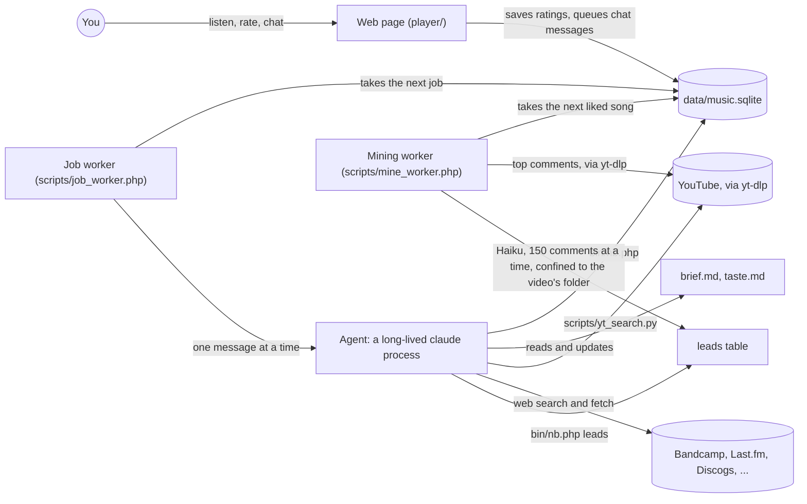

# noize-buffet

A music suggestion queue that an AI agent fills with new songs for your taste. The web page, the database and the agent's notes stay on your machine; the agent itself is Claude, run through your Claude Code account.

You chat with an AI agent in a local web page. It asks what you're after, then adds a batch of YouTube songs to a queue, and another whenever the queue runs low or you ask for more. You listen in the embedded player. It records how far you got, your rating, your notes and whether a song was new to you, and the agent uses all of that when it picks the next batch.

## Requirements

- [Claude Code](https://claude.com/claude-code), logged in with your own account (it runs the agent)
- PHP 8.1+ with `pdo_sqlite`
- Python 3 and [yt-dlp](https://github.com/yt-dlp/yt-dlp)
- A [TypeSafe](https://typesafe.ai) API key in `.env` (`start.py` creates `.env` from `.env.example` for you), and the Python packages: `python3 -m pip install -r requirements.txt`. TypeSafe is a paid service that scores yes/no questions about text; comment mining uses it to find the comments that name music. `start.py` stops if the key is missing. To run without one, use `python3 start.py --no-typesafe`; mining then uses a keyword filter instead, which found only about half as many of the useful comments in testing.

## Start

    python3 start.py

It checks the requirements, creates `.env` if needed, starts the web server, the agent worker and the comment-mining worker together, and prints the address: http://localhost:8000, or a random free port between 8001 and 8999 if 8000 is taken. `NB_PORT=8080 python3 start.py` uses exactly that port. Ctrl+C stops all three.

To start over from scratch, run `python3 start.py --reset`. It stops this folder's old server, worker, agent and mining processes, then **permanently deletes** your queue, ratings, notes, chat, mined comments, `brief.md` and `taste.md` (after you type `RESET` to confirm), and starts fresh. `.env` and `config.json` are kept.

## How it works

```mermaid
flowchart LR
    you(("You")) -->|"listen, rate, chat"| page["Web page (player/)"]
    page -->|"saves ratings, queues chat messages"| db[("data/music.sqlite")]
    worker["Job worker (scripts/job_worker.php)"] -->|"takes the next job"| db
    worker -->|"one message at a time"| agent["Agent: a long-lived claude process"]
    agent -->|"bin/nb.php"| db
    agent -->|"reads and updates"| files["brief.md, taste.md"]
    agent -->|"scripts/yt_search.py"| yt[("YouTube, via yt-dlp")]
    agent -->|"web search and fetch"| web[("Bandcamp, Last.fm, Discogs, ...")]
    miner["Mining worker (scripts/mine_worker.php)"] -->|"takes the next liked song"| db
    miner -->|"top comments, via yt-dlp"| yt
    miner -->|"Haiku, 150 comments at a time, confined to the video's folder"| leads["leads table"]
    agent -->|"bin/nb.php leads"| leads
```

`start.py` runs three processes: a small PHP web server for the page, a job worker, and a comment-mining worker. Everything you do in the page goes into a local SQLite database. Each chat message you send becomes a job, and the worker passes jobs one at a time to the agent. The agent is a Claude Code session running in the background, with no terminal window of its own. It stays running between messages, so replies after the first skip Claude Code's start-up time. It follows the rulebook in [`CLAUDE.md`](CLAUDE.md).

1. On first run the agent interviews you, one question at a time: what you're hoping to find, a few songs you love and why, and what you don't want. It looks up the songs and artists you named and checks anything unclear with you. Then it writes `brief.md` (your goal, in your words) and `taste.md` (its notes on your taste).
2. Before choosing a batch, the agent researches the songs you like on the web (at first, the ones you named): their labels and the other artists on them, their producers and collaborators, similar-artist pages, and the scenes around them. A single person's recommendation needs a second, independent signal before it counts. The agent finds each song on YouTube with `yt_search.py` and adds about 12 to the queue: mostly songs close to what you like, some from artists, labels and scenes it turned up while researching, and one wildcard that tests an edge of your taste. Each song records why it's there and the page that led to it.
3. The page plays the queue. For each song it records how far you got, your rating (top, yes, good, ok, meh, no), whether it was new to you, and whether it's good but not what you're looking for ("off-brief").
4. You tell the agent what you think of the song that's playing ("love the drums", "the vocals are generic"). It saves your comment as a note on that song, fills in the rating and toggles your comment implies (you can change them), and updates `taste.md`. You can also paste a song you found, ask for more songs, or ask it to stop suggesting an artist.
5. When only `refill_when_left` unplayed songs are left (5 by default), the worker asks the agent for the next batch, so the queue doesn't run out. You can also ask for more songs in the chat at any time. For each new batch, the agent reads your ratings, notes and chat since the last one, and reuses the artists, labels and scenes it has already found.
6. Songs you rate top or yes, and songs you name, get their YouTube comments mined in the background for other artists people mention (below).

While the agent works, the chat shows what it's doing ("Searching YouTube (12 songs)…", "Reading bandcamp.com…").

### Comment mining

People often name other artists under a song they like ("if you like this, try Burial"). For each song you rate top or yes, or name yourself, a third process downloads up to 3,000 of the video's top comments with yt-dlp and asks TypeSafe five questions about each one: does it name a song, an artist, an artist other than the video's own, is it spam, and does it try to give instructions to an AI. Comments that name only the video's own artist, and spam, are skipped. Comments that look like instructions to an AI are set aside in `quarantined.jsonl` and never sent to Claude.

The rest go to Haiku, Claude's smallest model, which lists the artists and songs each comment names, 150 comments per run. Each Haiku run can read and write only inside that video's folder under `comments/`, and can't read `.env`. If one changes a file it wasn't asked to, the video fails and nothing it wrote is used.

The names from every finished video are merged into leads. A name mentioned by 2 or more different people, or under 2 or more of your liked songs, is a confirmed lead; one person's mention is a hint. The video's own artist is never a lead under its own video. The agent reads the comments behind a lead and checks it against your brief before using it; the comments come from strangers, so its rulebook tells it to treat them as information, never as instructions. A video that failed is tried again a day later.

The "Comment mining" section under the playlist shows each video's progress, counts, and what was skipped or set aside.

### Memory

The agent's conversation restarts after `session_rotate_turns` messages, after any error, and when a job runs longer than `job_timeout_s` (both in `config.json`). What it knows about you is in `brief.md`, `taste.md` and the database. Every new conversation starts by reading the two files, and each batch starts by reading your latest feedback from the database. Anything you said that the agent didn't write into one of those is gone after a restart.

### Limits on the agent

The agent can read and edit files in this folder, and anything outside it is refused. Its only shell commands are `php bin/nb.php …` (the database) and `python3 scripts/yt_search.py …`. Anything else is blocked, and blocked attempts show up in the chat. It ignores your own Claude Code setup (your `CLAUDE.md` files, hooks, memory and skills), so it behaves the same for everyone. A settings rule stops it reading or changing `.env`, which holds your TypeSafe key. The web server answers only this page; requests from other websites open in the same browser are refused.

### Time and usage

On one measured run, chat replies took about 8 seconds and a first batch with web research took about 4 minutes. The agent runs on whatever account Claude Code is logged in with. A Claude subscription has no per-job charge, but jobs count toward your plan's usage limits, which you share with your own Claude Code use; that researched batch used about as much as 20 chat replies. With an API key, you pay per job. For each job, the worker terminal prints what it would have cost at API prices, as a measure of how heavy it was: about $0.05 per chat reply and $1 for that batch. Comment mining counts toward your usage too: one measured video (3,000 comments, 128 sent to Haiku) took about 7 minutes and $0.12 at API prices. TypeSafe, the only other paid service, cost about $0.09 for that video (about $0.03 per 1,000 comments).

If your usage runs out, the chat says so. Until the reset time in Claude's message, mining starts no new videos (the one in progress goes back in the queue) and automatic refills wait. The agent's conversation is kept.

## Where things live

- `brief.md`, `taste.md`: what you're after and what the agent has learned. You can edit both; the agent treats your edits as things you said.
- `data/music.sqlite`: your queue, listening history, notes and chat (never committed)
- `config.json`: `batch_size`; `mix` (share of close, lead and wildcard songs); `parent_model` (the Claude model the agent uses); `memory_picks` (most songs per batch the agent may suggest from its own memory rather than research); `refill_when_left` (unplayed songs left when a new batch is started automatically; 0 turns it off); `session_rotate_turns`; `job_timeout_s`; the `mining_*` settings (videos at once, comment cap, chunk size, and the model, time limit and budget for each Haiku run); `typesafe_*_threshold` (how sure TypeSafe must be, per question); `mining_child_permission_mode` (`""`, the default, or `"dontAsk"`; both passed the confinement check)
- `comments/<video_id>/`: one mined video: its comments, the flagged ones, the chunks, each Haiku run's output, `mine.log`, `children.jsonl` (each Haiku run's time, cost and any blocked tools), `coverage.json` and `quarantined.jsonl` (comments set aside as instructions to an AI, with their text); never committed
- `mining/`: the mining scripts, and `child_CLAUDE.md`, the instructions each Haiku run gets
- `requirements.txt`: the Python packages (yt-dlp, and the TypeSafe filter's)
- `CLAUDE.md`: the agent's rulebook
- `player/`: the web page; `scripts/job_worker.php`: the worker; `scripts/mine_worker.php` and `scripts/mine_video.php`: comment mining; `bin/nb.php`: the agent's database commands; `scripts/yt_search.py`: YouTube search; `lib/`: shared PHP

## Tests

    bash tests/run.sh

The tests use stand-ins for `claude`, `yt-dlp` and TypeSafe, so they cost nothing. Two checks use the real services:

- `php scripts/check_confinement.php` runs about five Haiku runs (about $0.05) that try to write or read outside their folder, read a protected secret, and pick up other instruction files. It prints `PASS` when every attempt is refused, and `INCONCLUSIVE` if you're out of usage.
- `python3 mining/typesafe_experiment.py` asks TypeSafe its five questions about 564 saved real comments and ten made-up injection attempts, and reports what each threshold would skip (about $0.02).

## When something goes wrong

- The worker terminal shows a `tool:` line for each tool the agent calls, as it happens. After each job it prints a line with the status, time, turns, cost at API prices and whether the agent process was started or reused, then any `BLOCKED:` lines for tools the agent wasn't allowed to use, and the path to the job's debug file.
- `data/jobs/<id>.json`: everything about one agent job: prompt, the agent process's pid and command, duration, blocked tools, every event the agent streamed back, and the path to Claude Code's full transcript of the conversation.
- `data/nb.log`: every database command the agent ran, with its exact input and output (one JSON object per line).
- `data/parent-stderr.log`: anything `claude` printed to stderr.
- `data/api-errors.log`: server-side errors from the web UI, with stack traces.
- The worker terminal's `[mine]` lines show each video's steps. For one video, see `comments/<video_id>/mine.log` (everything yt-dlp, the filters and the Haiku runs printed), `children.jsonl` and `coverage.json`.
- If every Haiku run fails at start-up and `mine.log` mentions MCP or a managed policy: a managed `managed-mcp.json` policy makes `--strict-mcp-config` exit at once. Remove that flag from `nb_child_command()` in `lib/mining.php`.

## License

[PolyForm Noncommercial 1.0.0](LICENSE): free for personal and other noncommercial use. For commercial use, contact me about a separate license.
