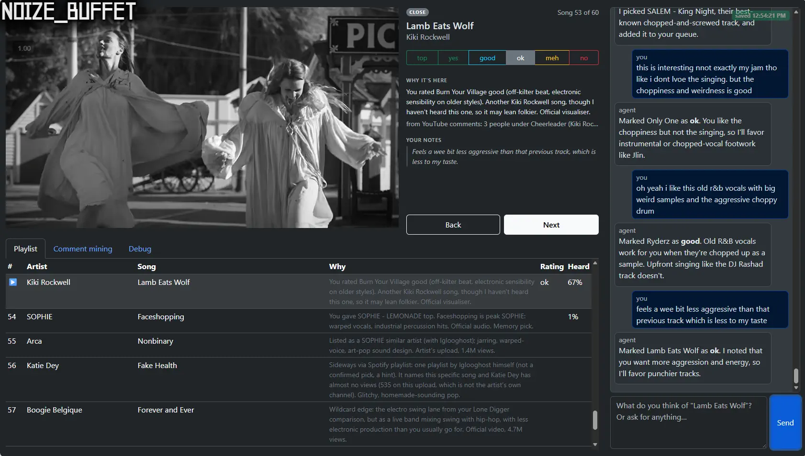
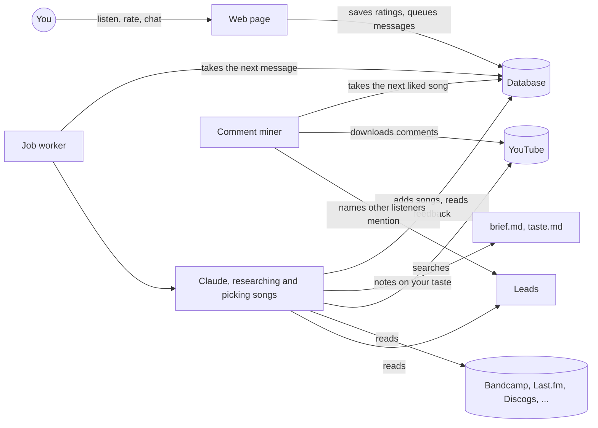

# noize-buffet

noize-buffet finds new music for you and keeps finding it.

You open a page in your web browser and describe the kind of music you're hoping to find, with a few songs you love and why. It fills a playlist with songs from YouTube that fit, and plays them. As you listen, you rate each song and say what you think of it in a chat box ("love the drums", "too slow"). The next songs it picks take all of that into account, and when the playlist runs low it adds more, so it never runs dry.

It finds songs the way a friend with a record collection and a lot of free time might: it looks up the labels, producers and scenes behind the songs you like, reads music sites, and follows the trail. It also reads the YouTube comments under songs you love, where other listeners often say "if you like this, try…", and follows up the names that more than one person mentions.

The picking is done by Claude, a machine-learning model.

**Cost.** It runs on your Claude subscription (a paid plan such as Pro or Max; the free plan doesn't include Claude Code), so there's nothing extra to pay Anthropic; it counts toward your plan's usage limits like any other Claude use (a new batch of songs uses about as much as 20 chat messages). The one extra cost is TypeSafe, a service that sorts text quickly and cheaply. noize-buffet uses it to pick out the YouTube comments that seem to mention other music, so Claude reads only those: on one song, 3,000 comments came down to 128. That saves a lot of your Claude usage, and costs up to about 9 cents for each song you love.

## Quickstart

You need Linux, Windows with WSL, or macOS (which also needs GNU coreutils; `start.py` explains). On Ubuntu or WSL, install the system packages with:

    sudo apt install php-cli php-sqlite3 php-intl php-mbstring python3-pip git

Install [Claude Code](https://code.claude.com/docs/en/setup):

    curl -fsSL https://claude.ai/install.sh | bash

Open a new terminal and run `claude` once to log in with your Claude account. Then:

    git clone https://github.com/greg-randall/noize-buffet.git
    cd noize-buffet
    python3 -m pip install -r requirements.txt
    cp .env.example .env

Sign up at [TypeSafe](https://typesafe.ai) and copy your API key. The `cp` command above made a settings file called `.env` in the noize-buffet folder (the dot at the start of its name hides it from most file browsers). Open it in a text editor, for example with `nano .env`, and paste your key straight after the `=` on the `TYPESAFE_API=` line (no quotes needed):

    TYPESAFE_API=your-key-here

Save the file (in nano: Ctrl+O, Enter, then Ctrl+X to exit). The key stays on your computer; `.env` is never uploaded with the code. Then start noize-buffet:

    python3 start.py

Open the address it prints (usually http://localhost:8000). It asks you a few questions about what you're looking for, one at a time, then builds your first playlist. That takes a few minutes. Ctrl+C in the terminal stops it; run `python3 start.py` again to pick up where you left off.

`start.py` checks everything it needs before it starts. If anything is missing, it lists it and prints the commands to install it for your system.

## How it works

```mermaid
flowchart LR
    you(("You")) -->|"listen, rate, chat"| page["Web page"]
    page -->|"saves ratings, queues messages"| db[("Database")]
    worker["Job worker"] -->|"takes the next message"| db
    worker --> agent["Claude, researching and picking songs"]
    agent -->|"adds songs, reads feedback"| db
    agent -->|"notes on your taste"| files["brief.md, taste.md"]
    agent -->|"searches"| yt[("YouTube")]
    agent -->|"reads"| web[("Bandcamp, Last.fm, Discogs, ...")]
    miner["Comment miner"] -->|"takes the next liked song"| db
    miner -->|"downloads comments"| yt
    miner -->|"names other listeners mention"| leads["Leads"]
    agent -->|"reads"| leads
```

`python3 start.py` runs three programs side by side, each doing one job:

- **The web page**, where you listen, rate and chat. Everything you do there is saved to a small database file on your computer.
- **The job worker**, which hands your chat messages, one at a time, to Claude. Claude runs in the background without a window of its own, and follows a rulebook in [`CLAUDE.md`](CLAUDE.md).
- **The comment miner**, which reads the YouTube comments under songs you love.

### Picking songs

1. **The interview.** The first time, Claude asks what you're hoping to find, a few songs you love and why, and anything you don't want. It checks the songs you named on YouTube and asks about anything unclear. It writes your goal, in your words, to `brief.md`, and its notes on your taste to `taste.md`.
2. **Research.** Before each batch, Claude looks into the songs you like: their record labels and the other artists on them, the producers and collaborators, "similar artist" pages on music sites, and the scenes around them. One person's recommendation isn't enough on its own; it needs a second, independent sign.
3. **The batch.** It adds about 12 songs: mostly close to what you like, some from the artists and labels it turned up, and one wildcard to test the edges of your taste. Each song records why it was picked and the page that led to it, which you can see in the playlist.
4. **Listening.** For each song, the page records how far you got, your rating (top, yes, good, ok, meh, no), whether it was new to you, and whether it's good but not what you're after.
5. **Chatting.** When you comment on the song that's playing, Claude saves your words as a note on it, fills in the rating your comment implies (you can change it), and updates its notes on your taste. You can also paste a song you found, ask for more, or ask it to stop suggesting an artist.
6. **Refills.** When only 5 songs are left unplayed, a new batch starts automatically. Each batch reads your ratings, notes and chat since the last one.

While Claude works, the chat shows what it's doing ("Searching YouTube (12 songs)…", "Reading bandcamp.com…").

### Reading the comments

When you rate a song top or yes, or name it in the interview, the comment miner downloads up to 3,000 of its top YouTube comments. TypeSafe, a paid service that answers yes/no questions about text, picks out the comments that name another artist or song, and skips comments that only praise the video's own artist, spam, and anything that looks like an attempt to give instructions to a computer. A small, cheap Claude model called Haiku then reads the rest and lists every artist and song they name.

Names that 2 or more different people mention, or that come up under 2 or more of your songs, become **confirmed leads**; one person's mention is a **hint**. Claude reads the comments behind a lead and checks it against your goal before using it. The "Comment mining" section under the playlist shows each song's progress. A song with 3,000 comments takes about 7 minutes.

### Memory

Claude's conversation starts over every 40 messages and after an error. What it knows about you lives in `brief.md`, `taste.md` and the database, and every new conversation starts by reading them. Anything you said that it didn't write down is forgotten. You can edit both files yourself; it treats your edits as things you said.

### What Claude can and can't do

It can read and change files in the noize-buffet folder, and nothing outside it. It can run two commands: one for the database and one for searching YouTube. It can't read `.env`, where your TypeSafe key is kept. The comments it reads are written by strangers, so its rulebook tells it to treat them as information, never as instructions. The Haiku readers are more tightly limited: each can read and write only inside one song's folder.

### Time and usage

On one measured run, chat replies took about 8 seconds and a first batch with research about 4 minutes. With a subscription, jobs count toward your plan's usage limits, which you share with your own Claude use; a researched batch uses about as much as 20 chat replies. With an API key you pay per job: about $0.05 per chat reply and $1 per batch. Reading one song's comments took about 7 minutes and $0.12 of Claude usage, plus about $0.09 of TypeSafe (about 3 cents per 1,000 comments).

If your Claude usage runs out, the chat says so. Until it resets, comment reading and automatic refills wait, and nothing is lost.

### Other ways to start

- `python3 start.py --reset` stops any old noize-buffet processes in this folder and **permanently deletes** your playlist, ratings, notes, chat, comments and taste files, after you type `RESET` to confirm. `.env` and `config.json` are kept.
- `NB_PORT=8080 python3 start.py` uses that exact port. Without it, noize-buffet uses 8000, or a random free port if 8000 is taken.
- `python3 start.py --no-typesafe` runs without a TypeSafe key. Comment reading then uses a simple keyword filter, which found only about half as many useful comments in testing.

`config.json` holds the settings: how many songs per batch and the mix between close picks, leads and wildcards, which Claude model to use, when to refill, and the comment-reading limits.

## More detail

[ARCHITECTURE.md](ARCHITECTURE.md) covers how it's built: the processes and database, the agent's permissions, each step of comment mining, how the Haiku readers are confined and checked, every setting and file, the tests, and what to look at when something goes wrong.

## License

[PolyForm Noncommercial 1.0.0](LICENSE): free for personal and other noncommercial use. For commercial use, contact me about a separate license.
